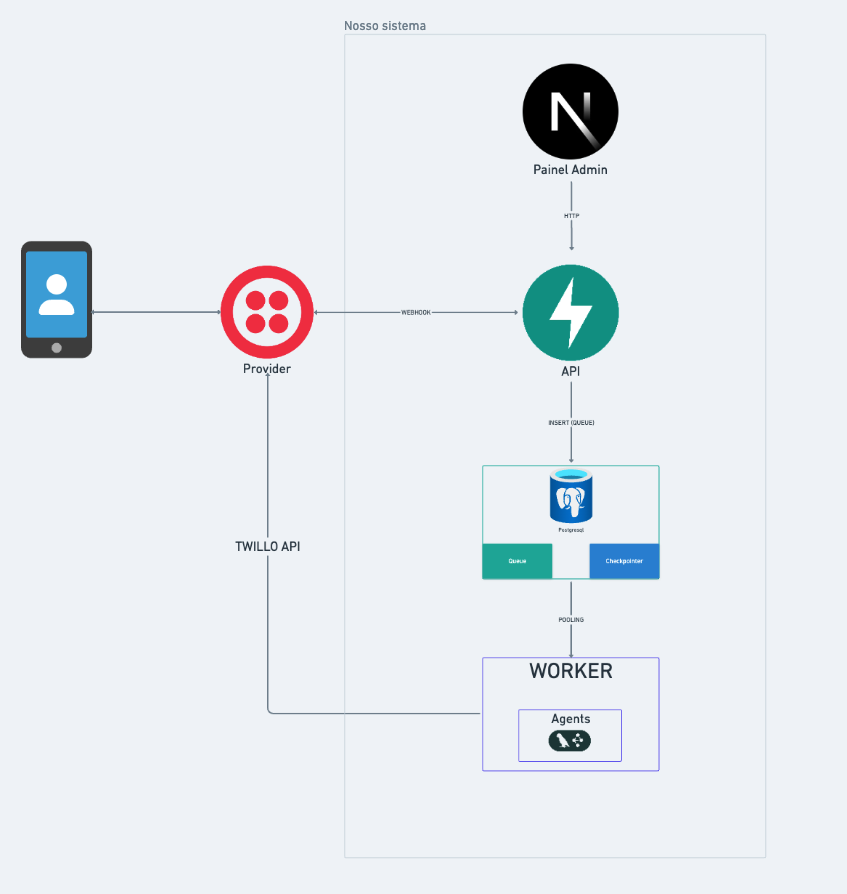

# WhatsApp LangChain

Template educacional e production-ready para construir sistemas de agentes de IA no WhatsApp com LangGraph.

## O que é?

Um sistema completo e production-ready que conecta agentes de IA ao WhatsApp. Você define o comportamento do agente com LangChain/LangGraph, e a infraestrutura do projeto cuida do resto: recebimento de mensagens, processamento assíncrono, memória e operação.

O objetivo deste repositório é ensinar arquitetura de sistemas em volta do agente:
- entrada confiável de mensagens
- processamento assíncrono
- persistência de contexto e memória
- observabilidade, retries e limites

## Fase Atual

**Fase 4 concluída no código.**

Já implementado no código:
- API FastAPI com webhook Evolution API assíncrono (`/webhook/evolution/{token}`)
- fila em PostgreSQL com debounce e retry
- worker assíncrono para processamento LangGraph
- bootstrap de schema LangGraph no startup (sem criação lazy no primeiro request)
- ciclo de vida explícito no worker para `checkpointer`/`store` (abertos no boot e reutilizados)
- checkpointer PostgreSQL (`thread_id`) para contexto por conversa
- memória semântica com `AsyncPostgresStore` + embeddings (`user_id`)
- middleware de contexto (`trim`, `summarize`, `none`)
- tools de memória semântica (`save_memory` e `read_memory`)
- processamento de mídia (imagem e áudio) via OpenRouter multimodal
- rate limit distribuído por telefone via Redis (sliding window)
- rotas administrativas (`/api/agents`, `/api/chats`, `/api/metrics`) protegidas por login
- admin panel (Next.js) em `frontend/`: dashboard, conversas e agentes
- endpoint síncrono educacional (`/webhook/sync`)
- validação do webhook via token secreto no path (Evolution não assina requests)
- envio real de resposta via Evolution API (self-hosted)
- typing indicator via Evolution API antes do processamento
- deploy via Docker Compose com proxy reverso (Caddy) e TLS automático
- stress test com Locust (`tests/stress/`)
- documentação de setup do Evolution API e túnel com cloudflared

## Arquitetura



Fluxo principal:

```text
WhatsApp/Evolution API -> API (/webhook/evolution/{token}) -> PostgreSQL (message_queue)
                                              -> Worker -> LangGraph Agent
                                              -> PostgreSQL (response, conversation)
```

Separar API e Worker evita bloqueio na borda HTTP e melhora confiabilidade sob carga.

## Quick Start

### 1. Setup

```bash
git clone <repo-url>
cd whatsapp-langchain
make setup
cp .env.example .env
```

Edite o `.env` e configure pelo menos:

```bash
OPENROUTER_API_KEY=sk-or-v1-...
```

### 2. Suba o stack local

```bash
make up
# sobe: db + redis + api + worker + frontend
```

### 3. Admin Panel

Acesse `http://localhost:3000/login` e autentique com `ADMIN_USERNAME`/
`ADMIN_PASSWORD` (configure no `.env`). Sem `make up`, rode o frontend
isoladamente em modo dev com `make frontend` (requer `make api` e
`make db` rodando à parte).

### Acesso ao banco (DBeaver)

Use estes dados de conexão PostgreSQL:

- Host: `localhost`
- Port: `5432`
- Database: `whatsapp_langchain`
- User: `postgres`
- Password: `postgres`

Valide saúde da API:

```bash
curl http://localhost:8000/health
```

### 4. Teste rápido (endpoint síncrono)

```bash
curl -X POST "http://localhost:8000/webhook/sync?agent=secretaria" \
  -H "Content-Type: application/json" \
  -d '{"phone":"+5511999999999","message":"Olá!"}'
```

### 5. Teste assíncrono (simulando Evolution API)

```bash
curl -X POST "http://localhost:8000/webhook/evolution/SEU_TOKEN?agent=secretaria" \
  -H "Content-Type: application/json" \
  -d '{
    "event": "messages.upsert",
    "instance": "minha-instancia",
    "data": {
      "key": {"remoteJid": "5511999999999@s.whatsapp.net", "fromMe": false, "id": "MSG123"},
      "message": {"conversation": "Quero aprender sistemas de agentes"},
      "messageType": "conversation"
    }
  }'
```

Acompanhe métricas (rotas `/api/*` exigem sessão de admin — use um cookie
jar para manter o login entre requisições):

```bash
curl -c /tmp/cookies.txt -X POST http://localhost:8000/api/auth/login \
  -H "Content-Type: application/json" \
  -d '{"username":"admin","password":"SUA_SENHA"}'
curl -b /tmp/cookies.txt http://localhost:8000/api/metrics
curl -b /tmp/cookies.txt http://localhost:8000/api/chats
```

Ou simplesmente use o Admin Panel em `http://localhost:3000`.

## Estrutura do Projeto

```text
whatsapp-langchain/
├── src/whatsapp_langchain/
│   ├── agents/        # Catálogo de agentes, middleware e tools
│   ├── server/        # API FastAPI (webhooks + auth + admin APIs)
│   ├── worker/        # Loop consumidor da fila e execução dos agentes
│   └── shared/        # Config, DB, Redis, fila, modelos, logging, factory LLM
├── frontend/           # Admin Panel (Next.js) — dashboard, conversas, agentes
├── db/migrations/     # Schema SQL (fila + conversas + vector)
├── docs/              # Documentação técnica e onboarding
├── scripts/            # Scripts operacionais (backup do banco)
├── tests/
│   ├── unit/ e integration/  # Testes automatizados
│   └── stress/                # Stress test (Locust)
├── Caddyfile           # Proxy reverso / TLS (produção)
└── docker-compose.prod.yml  # Override de produção (proxy, restart, limites)
```

## Aprendizado (foco em sistemas)

Este projeto é para aprender decisões de engenharia reais:
- fronteiras entre serviços (`server`, `worker`, `shared`)
- contratos de dados (`MessageQueue`, `Conversation`, webhook payload)
- estados e transições (`queued -> processing -> done/failed`)
- consistência operacional (retry com backoff, debounce, lease)
- limites e custo (rate limit HTTP e rate limit de LLM)

Para detalhes técnicos:
- [Arquitetura](docs/ARCHITECTURE.md)
- [Primeiros Passos](docs/GETTING_STARTED.md)
- [Criando Agentes](docs/ADDING_AGENTS.md)
- [Banco de Dados](docs/DATABASE.md)
- [Integração Evolution API](docs/EVOLUTION_API.md)
- [Google Calendar (agendamento)](docs/GOOGLE_CALENDAR.md)
- [Deploy](docs/DEPLOY.md)


## Comandos úteis

```bash
make help
make api
make worker
make frontend
make migrate
make test
make test-live
make check
make logs
make reset
make test-demo
make backup
make stress
```

## Roadmap

- **Fase 1** concluída: base de agentes + middleware de contexto
- **Fase 2** concluída: API + Worker + PostgreSQL + observabilidade operacional
- **Fase 3** concluída: integração WhatsApp (Evolution API) + typing + reforço dos testes de debounce
- **Fase 4** concluída: admin panel (Next.js) + deploy (Docker Compose + Caddy/TLS) + stress test (Locust) + hardening (rate limit distribuído via Redis, auth do admin panel, containers non-root)

## Licença

[TOPHAWKS Community License](LICENSE) - uso restrito a membros da comunidade [TOPHAWKS](https://www.rhawk.pro/comunidade).
